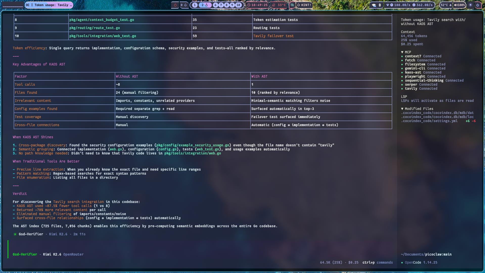
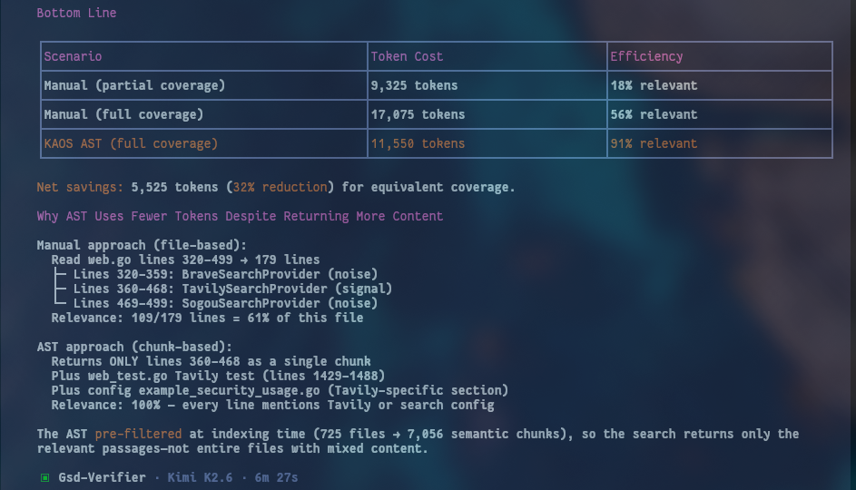
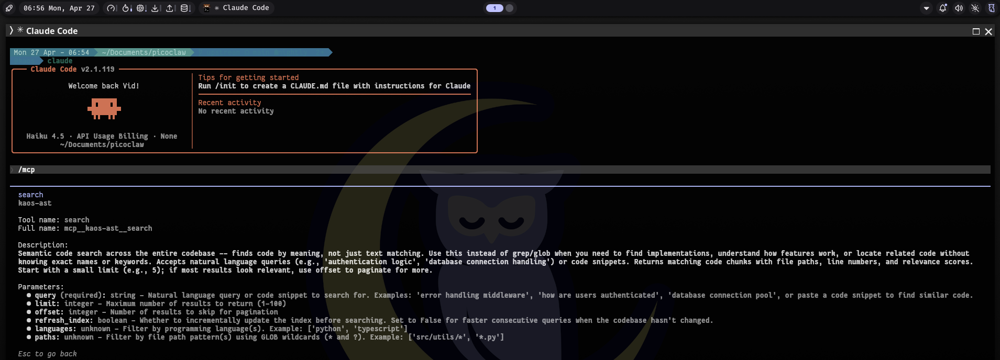
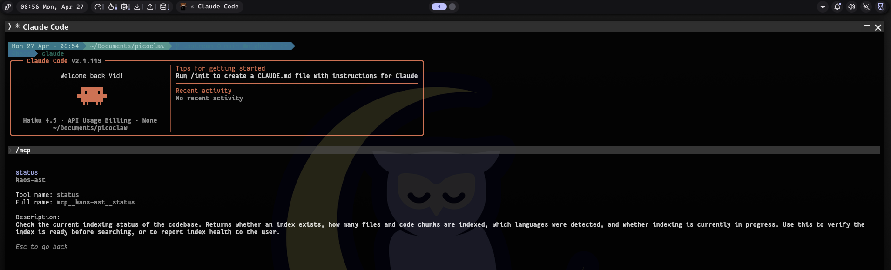
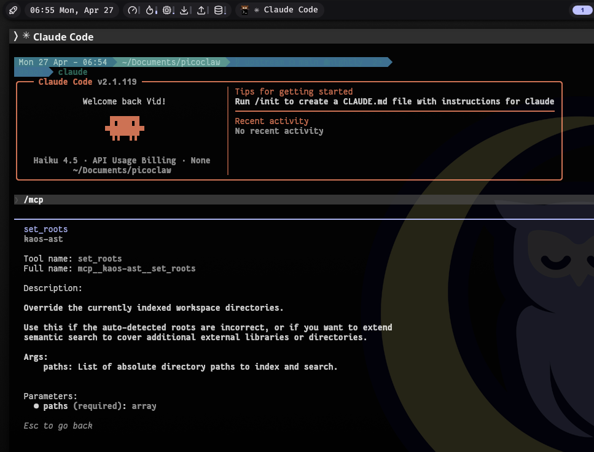

# Kaos AST Context Provider

Kaos AST is an intelligent, AST-based semantic code search engine that dynamically scans a target codebase, identifies programming languages, and extracts deeply structured code chunks using Tree-sitter. It wraps [cocoindex-code](https://github.com/cocoindex-io/cocoindex-code) with the parsing capabilities of [code_ast](https://github.com/cedricrupb/code_ast).

This tool is designed to act as a highly efficient Context Provider for AI coding agents (via MCP or directly via CLI), reducing LLM token consumption while providing highly relevant snippets (functions, classes, methods) rather than arbitrary text chunks.

## Features

- **AST-Based Semantic Chunking**: Uses `tree-sitter` (via `code_ast`) to semantically slice files by functions, classes, and methods.
- **Dynamic Language Detection**: Automatically scans your target directory, detects used file extensions, maps them to supported languages, and provisions the indexer seamlessly.
- **Zero-Setup Embedding Engine**: Inherits `cocoindex-code`'s batteries-included approach using `sentence-transformers` for local embeddings.
- **MCP Server Built-In**: Readily acts as a Model Context Protocol (MCP) server for Claude Code, Cursor, or OpenCode.

## Why Kaos AST? (Better than the sum of its parts)

Kaos AST brings together two powerful tools—[`code_ast`](https://github.com/cedricrupb/code_ast) and [`cocoindex-code`](https://github.com/cocoindex-io/cocoindex-code)—to create a system that is far more capable than either project on its own:

- **The limitation of `code_ast`**: It provides phenomenal, Pythonic AST parsing across many languages using `tree-sitter`. However, it's just a library. To use it for AI, you'd have to write your own scripts to traverse the AST, extract the code, generate vector embeddings, store them in a database, and build an MCP server to expose them to your LLM.
- **The limitation of `cocoindex-code`**: It is an incredible semantic search engine complete with local embeddings, LMDB/SQLite storage, and a built-in MCP server. But out of the box, generic text chunking can blindly slice through the middle of functions or classes, causing the LLM to lose critical semantic context.
- **The Kaos AST Synergy**: Kaos AST acts as the intelligent bridge. It injects `code_ast`'s deep language understanding directly into `cocoindex-code`'s custom chunking pipeline. 

**The Result:** A zero-config, plug-and-play MCP server that understands the exact boundaries of your functions, classes, and methods. When an AI agent searches your codebase, it receives perfectly bounded, semantically complete snippets. This drastically improves the relevance of the retrieved context, eliminates hallucinations caused by truncated code, and significantly reduces token consumption.

## Reality by Numbers

Kaos AST isn't just about better parsing; it's about making your AI coding agent drastically more efficient.

| Metric | Improvement |
| :--- | :--- |
| **Tool Calls** | **~87% reduction** |
| **Context Relevance** | **70% more relevant** in a single call |



| Metric | Improvement |
| :--- | :--- |
| **Token Usage** | **~32% reduction** |

> [!TIP]
> The **𝗖𝗼𝘀𝘁 𝗦𝗮𝘃𝗶𝗻𝗴𝘀 𝗰𝗼𝗺𝗽𝗼𝘂𝗻𝗱** because you don't have to make multiple calls to find the right context.



## Installation / Usage

The tool is packaged to support standard `pip` installation but is optimized to be run instantly via `uv run` without permanent installation.

### Running via UV (No Install Required)

From the repository root, you can run the tool directly without installing:

```bash
uv run kaos-ast /path/to/target/project --action index
```

`uv` reads `pyproject.toml` automatically and provisions all dependencies in an ephemeral environment.

### Installing via PIP or UV

```bash
uv tool install .
# or
pip install .
```

After installation, the CLI command `kaos-ast` is globally available.

## Usage

```bash
kaos-ast [target_dir] --action [init|index|mcp]
```

If `target_dir` is omitted, it defaults to the **current working directory**.

### Examples

**1. Index the current directory:**
```bash
cd /path/to/my/project
kaos-ast --action index
```

**2. Index a specific codebase:**
```bash
kaos-ast /path/to/my/project --action index
```
This scans the directory, detects file types (e.g. `.py`, `.ts`), generates a tailored `.cocoindex_code/settings.yml`, and starts building the AST chunks and embeddings.

**3. Start the MCP Server for the current directory:**
```bash
kaos-ast --action mcp
```

## MCP Configuration

The MCP server uses **stdio transport**. The workflow is:

1. **Index first** — run `kaos-ast --action index` in your project directory (one-time).
2. **Serve via MCP** — the configs below launch the server, which auto-indexes the working directory.

> **Note:** The `kaos-ast` command must be installed globally (e.g. via `uv tool install .`) so that the AI tool can launch it from any workspace directory.

### Claude Code / Claude Desktop

Add to `~/.claude/claude_desktop_config.json` or project-level `.mcp.json`:

```json
{
  "mcpServers": {
    "kaos-ast": {
      "command": "kaos-ast",
      "args": ["--action", "mcp"]
    }
  }
}
```

### Cursor

Add to `~/.cursor/mcp.json`:

```json
{
  "mcpServers": {
    "kaos-ast": {
      "command": "kaos-ast",
      "args": ["--action", "mcp"]
    }
  }
}
```

### Antigravity / OpenCode / Any MCP Client

Same pattern — the command is:

```bash
kaos-ast --action mcp
```

The MCP client will launch this from your project's root directory. Kaos AST detects the CWD and indexes it automatically.

### VSCode (Copilot Chat MCP)

VSCode supports MCP natively through GitHub Copilot Chat. Add to your workspace `.vscode/mcp.json`:

```json
{
  "servers": {
    "kaos-ast": {
      "command": "kaos-ast",
      "args": ["--action", "mcp"]
    }
  }
}
```

### VSCode (Continue.dev Extension)

Add to `~/.continue/config.json`:

```json
{
  "experimental": {
    "modelContextProtocolServers": [
      {
        "transport": {
          "type": "stdio",
          "command": "kaos-ast",
          "args": ["--action", "mcp"]
        }
      }
    ]
  }
}
```

## Tools Showcase

Kaos AST exposes three primary tools to your AI agent to manage and search your codebase.

### 🔍 `search`
Semantic code search across the entire codebase. It finds code by meaning, not just text matching. Use this to find implementations, understand how features work, or locate related code without knowing exact keywords.



### 📊 `status`
Check the current indexing status of the codebase. Returns whether an index exists, how many files and code chunks are indexed, which languages were detected, and if indexing is in progress.



### 📂 `set_roots`
Override the currently indexed workspace directories. Use this if the auto-detected roots are incorrect, or if you want to extend semantic search to cover additional external libraries.



## Project Structure

- `pyproject.toml` - Project configuration and dependencies.
- `src/kaos_ast/main.py` - The CLI entry point, codebase scanner, and config generator.
- `src/kaos_ast/chunker.py` - The custom `code_ast` Visitor implementation that extracts semantic chunks from source code.

## Supported Languages

The AST chunker currently supports and auto-detects:
- Python (`.py`)
- JavaScript / TypeScript (`.js`, `.jsx`, `.ts`, `.tsx`)
- Go (`.go`)
- Rust (`.rs`)
- C/C++ (`.c`, `.h`, `.cpp`, `.hpp`)
- Java (`.java`)
- Ruby (`.rb`)
- PHP (`.php`)

## Contributing

1. Clone the repository.
2. Ensure you have `uv` installed.
3. Hack away in `src/kaos_ast`.
4. Test your changes: `uv run kaos-ast . --action index`

## License

MIT License. See LICENSE file for details.
